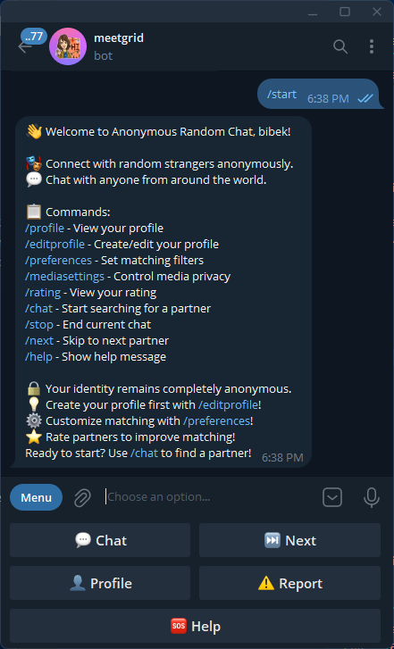
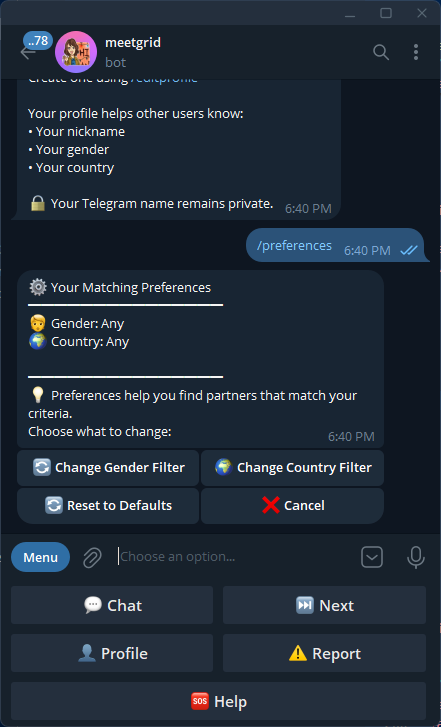
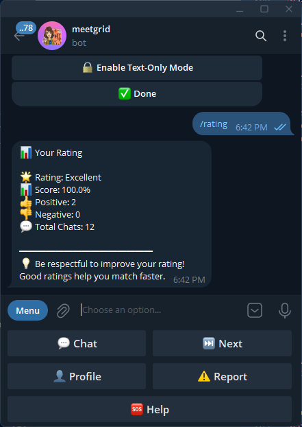
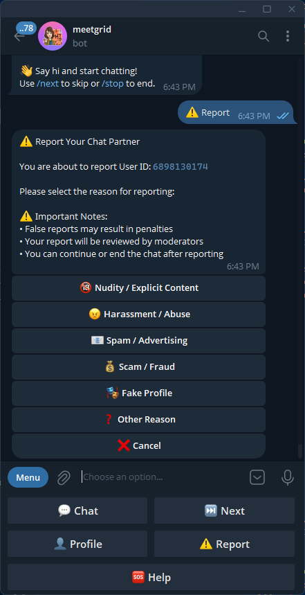
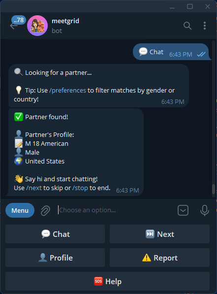
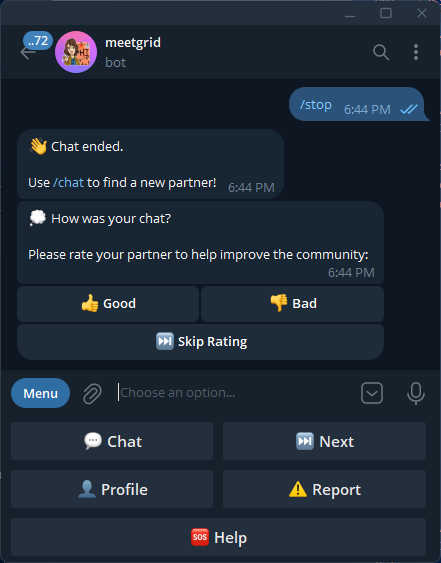

# MeetGrid 🎭

**MeetGrid** is a free, anonymous random chat bot for Telegram that connects you with people from around the world instantly. Share messages, photos, voice notes, and more in complete privacy.

## 🌟 Features

- **🎭 100% Anonymous** - Your identity is completely protected
- **⚡ Instant Matching** - Get connected in seconds
- **🌍 Global Reach** - Connect with people from 150+ countries
- **📱 Full Media Support** - Share text, photos, videos, voice notes, stickers, and more
- **🛡️ Safe & Moderated** - Advanced reporting system and auto-ban feature
- **💯 Always Free** - No subscriptions, no hidden fees
- **🎯 Smart Preferences** - Filter by gender, country, and media preferences
- **🔄 Skip Anytime** - Move to the next person instantly

## 📸 Preview

### Interface Previews

<table>
  <tr>
    <td align="center" width="33%">
      
       
      <em>Chat Interface</em>
    </td>
    <td align="center" width="33%">
      
       
      <em>Preference Screen</em>
    </td>
    <td align="center" width="33%">
      
       
      <em>Media Sharing</em>
    </td>
  </tr>
  <tr>
    <td align="center" width="33%">
      
       
      <em>Rating </em>
    </td>
    <td align="center" width="33%">
      
       
      <em>Report </em>
    </td>
    <td align="center" width="33%">
      
       
      <em>Start Chat</em>
    </td>
  </tr>
  <tr>
    <td align="center" width="33%">
      
       
      <em>End Chat</em>
    </td>
    <td align="center" width="33%">
    </td>
    <td align="center" width="33%">
    </td>
  </tr>
</table>

## 🚀 Getting Started

### Quick Start

1. **Open the Bot** - Click here: [**@meetgrid_bot**](https://t.me/meetgrid_bot)
2. **Press Start** - Initialize the bot
3. **Use `/chat`** - Get matched instantly with a random person
4. **Start Chatting!** - Enjoy your anonymous conversation

### Available Commands

| Command | Description |
|---------|-------------|
| `/start` | Start the bot and see welcome message |
| `/chat` | Find a random chat partner |
| `/stop` | End current conversation |
| `/next` | Skip to next person |
| `/profile` | View your profile |
| `/editprofile` | Edit your profile |
| `/preferences` | Set gender & country filters |
| `/mediasettings` | Enable / disable media sharing |
| `/report` | Report inappropriate behavior |
| `/help` | Show help message |
| `/cancel` | Cancel your current operation |

## 🌐 Links

- **🌍 Website:** [https://meetgrid.netlify.app/](https://meetgrid.netlify.app/)
- **💬 Telegram Bot:** [https://t.me/meetgrid_bot](https://t.me/meetgrid_bot)

## 🛡️ Safety & Security

Your safety is our priority. We've implemented:

- ✅ **Auto-Ban System** - Users with 5+ reports are automatically banned
- ✅ **Instant Reporting** - Report inappropriate behavior with one command
- ✅ **Complete Anonymity** - Your personal info is never shared
- ✅ **24/7 Moderation** - Active admin team monitoring reports
- ✅ **Rate Limiting** - Prevents spam and abuse
- ✅ **Skip Feature** - Exit uncomfortable situations instantly

## 📊 Statistics

- 👥 **50,000+** Active Users
- 💬 **1,000,000+** Total Chats
- 🌍 **150+** Countries
- ⭐ **4.8/5** User Rating

## 🎯 How It Works

1. **Match** - Our algorithm instantly connects you with a random person based on your preferences
2. **Chat** - Share messages, media, and have meaningful conversations
3. **Skip** - Not interested? Use `/next` to move to the next person
4. **Report** - Encountered inappropriate behavior? Use `/report` to keep the community safe

## 💡 Use Cases

- 🌍 **Language Exchange** - Practice languages with native speakers
- 🤝 **Make Friends** - Connect with people worldwide
- 🎭 **Anonymous Venting** - Share your thoughts freely
- 🎮 **Gaming Partners** - Find people to play games with
- 📚 **Cultural Exchange** - Learn about different cultures
- 💬 **Random Conversations** - Just have fun talking to strangers

## 📱 Supported Features

- ✅ Text Messages
- ✅ Photos & Images
- ✅ Videos
- ✅ Voice Messages
- ✅ Audio Files
- ✅ Stickers & GIFs
- ✅ Documents
- ✅ Location Sharing
- ✅ Contact Sharing

## ❓ FAQ

**Q: Is MeetGrid completely free?**  
A: Yes! 100% free with no hidden charges or premium features.

**Q: Is my identity safe?**  
A: Absolutely! Your personal information is never shared with other users.

**Q: Can I choose who I chat with?**  
A: You can set preferences for gender and country, and skip to the next person anytime.

**Q: What if I encounter inappropriate behavior?**  
A: Use the `/report` command immediately. Users with multiple reports are auto-banned.

**Q: How many people can I chat with per day?**  
A: Unlimited! Chat with as many people as you want.

## 🤝 Contributing

We welcome contributions! If you'd like to improve MeetGrid:

1. Fork the repository
2. Create your feature branch (`git checkout -b feature/AmazingFeature`)
3. Commit your changes (`git commit -m 'Add some AmazingFeature'`)
4. Push to the branch (`git push origin feature/AmazingFeature`)
5. Open a Pull Request

## 📄 License

This project is licensed under the MIT License - see the [LICENSE](LICENSE) file for details.

## 📞 Support

Need help? Have questions?

- 📧 Contact us through the bot: [@meetgrid_bot](https://t.me/meetgrid_bot)
- 🌐 Visit our website: [meetgrid.netlify.app](https://meetgrid.netlify.app/)
- 📝 Check our [FAQ section](#-faq)

## 🌟 Show Your Support

If you like MeetGrid, please:

- ⭐ Star this repository
- 🔗 Share with your friends
- 💬 Join our Telegram bot: [@meetgrid_bot](https://t.me/meetgrid_bot)

---

**Made with ❤️ for anonymous conversations**

[Website](https://meetgrid.netlify.app/) • [Telegram Bot](https://t.me/meetgrid_bot) • [Report Issues](https://t.me/meetgrid_bot)

© 2025 MeetGrid. All rights reserved.

